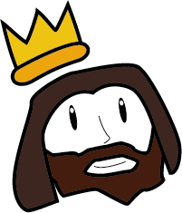
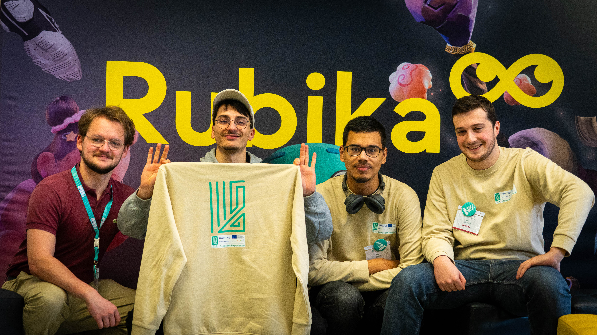

# Charlemagne


## Pitch of the project

The aim of this project is to provide students with an application whose main goal is to make them think about each steps involved to solve a problem. This application is not suppose to replace teachers but to help them guide their student towards a better utilization of AI.




## Team


1. Machado Constantin : `Rubika`
2. Farrasse Paul : `Rubika`
3. Adrien Zianne : `Umons`
3. Foucart Axel : `Umons`



## Structure of the folder

We need all the source files that you used, you can organise your repo as you see fit.
If you used Miro, Figma or any other cloud based tools please put the links of the source files and add the exported documents.

## Requirements

You will need to download the Ollama. 
On linux, we recommand using this link : [Download Ollama on linux](https://ollama.com/download)

Then download the `llama3.2` model using the following command
```bash
ollama pull llama3.2
```

To check if it's working by running the model on your machine.
```bash
ollama run llama3.2
```
After you are free to close it if everything went right. 


### To run our demo

In order to easily run the demo, simply run the [chat.html](/Code/chat.html) file using the [live server](https://marketplace.visualstudio.com/items?itemName=ritwickdey.LiveServer) extension on **visual studio**.


## Context

This project was developed during CrossTechXperience Interreg project ([http://www.crosstechxperience.eu](http://www.crosstechxperience.eu)) Hackathon #1.
This hackathon took place at Rubika ([https://rubika-edu.com/](https://rubika-edu.com/)) the 15th and 16th of February 2025.


